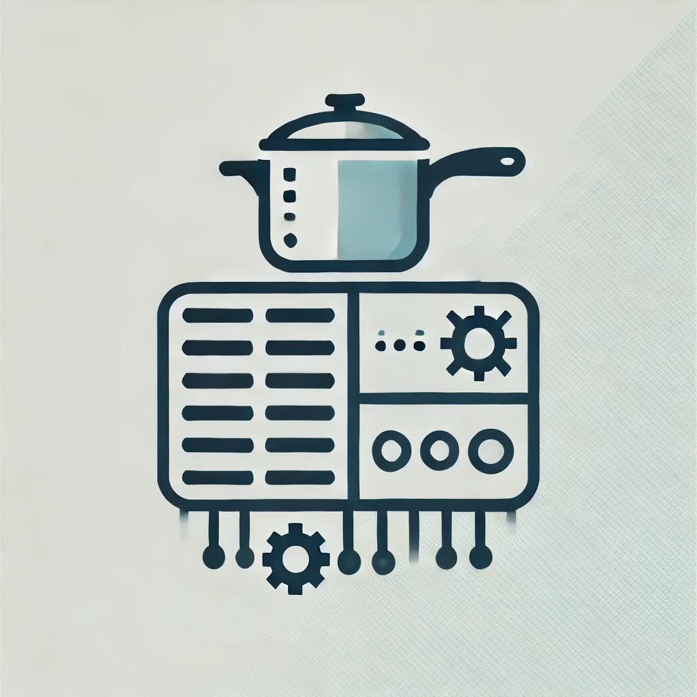
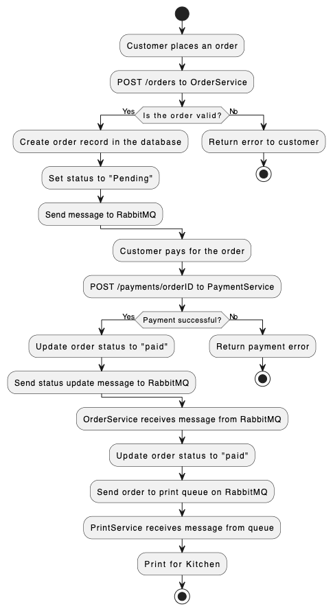
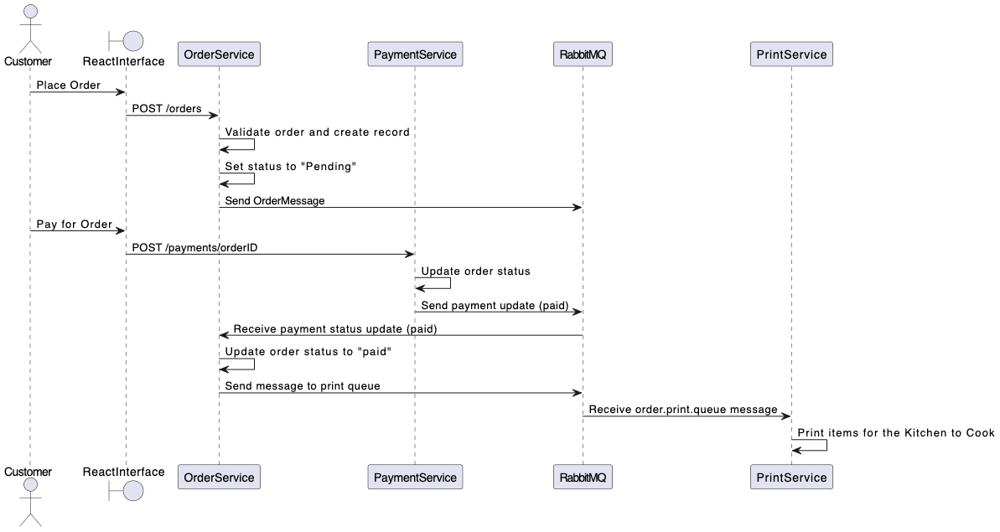

## KitchenSystem




### Overview

**KitchenSystem** is a distributed microservices-based architecture built to manage the operations of a kitchen in a restaurant environment. It includes various microservices that handle customer orders, payments, menu management, and printing operations. The microservices communicate asynchronously through RabbitMQ and are orchestrated using Docker Compose for a seamless setup.

### Microservices

1. **OrderService**: Handles the creation, retrieval, and status updates of orders.
2. **PaymentService**: Manages payments and updates the corresponding order's payment status.
3. **MenuService**: Manages the available plates (menu items).
4. **PrintService**: Listens to RabbitMQ for print requests and processes kitchen printing tasks.
5. **EurekaServer**: Provides service discovery, allowing microservices to dynamically register and discover each other.
6. **UserFronted**: React-based frontend that allows users to create orders and manage them.

Each service operates independently but is connected via the **Eureka Server** and **RabbitMQ**, making the system highly resilient and scalable.

### Technologies Used

- **Java 22**: The core programming language for the backend microservices.
- **Spring Boot**: A robust framework used to create microservices.
- **Spring Cloud Eureka**: Service registry and discovery tool.
- **RabbitMQ**: Message broker that allows asynchronous communication between services.
- **Spring Data JPA**: Used for data persistence with PostgreSQL.
- **PostgreSQL**: Relational database used by multiple services, with each having its own schema.
- **Flyway**: Handles schema migrations.
- **Docker & Docker Compose**: Used for containerizing the microservices and orchestrating them.
- **React**: The frontend framework used to create the user-facing component.
- **JUnit 5 & Testcontainers**: Testing tools for ensuring robust test coverage of each microservice.

### Architecture

The architecture is centered on a microservices paradigm, where each service is independently developed, deployed, and scaled. The system leverages **Eureka** for service discovery, ensuring that each microservice can locate others dynamically. Communication between services is facilitated by **RabbitMQ**, which provides event-driven, asynchronous message passing.

### Endpoints

#### OrderService
- `POST /orders`: Create a new order.
- `GET /orders`: Retrieve all orders.
- `GET /orders/{id}`: Retrieve a specific order by ID.
- `GET /orders/customer/{email}`: Retrieve all orders placed by a specific customer using their email.
- `PUT /orders/{id}/pay`: Mark an order as "paid".

#### PaymentService
- `POST /payments`: Process a payment for an order.
- `GET /payments/{orderId}`: Retrieve the payment status of an order.
- `PUT /payments/{orderId}/confirm`: Confirm a payment manually (useful for testing or simulation).

#### MenuService
- `POST /plates`: Add a new plate (menu item) to the system.
- `GET /plates`: Retrieve all available plates.
- `GET /plates/{id}`: Retrieve a specific plate by its ID.
- `DELETE /plates/{id}`: Delete a plate from the system.

#### PrintService
- **No direct API**: The service listens to RabbitMQ for print job requests and processes them accordingly.

#### UserFronted (React)
- **Orders**: Users can create orders, view the menu, and track the status of their orders.

### Orchestration with Docker Compose

The system is orchestrated using Docker Compose, which manages the lifecycle of all microservices, the message broker (RabbitMQ), the PostgreSQL database, and the frontend. The services are defined in a `docker-compose.yml` file that automates the setup process, ensuring that all components can communicate via a shared network.

#### Key Docker Components:
1. **Eureka Server**: Exposed on port 8761, all microservices register themselves with Eureka.
2. **RabbitMQ**: Exposed on port 5672 (message broker port) and 15672 (management UI). All microservices rely on RabbitMQ for message passing.
3. **PostgreSQL**: The database container manages the schemas used by each microservice. A persistent volume is used to store database data.
4. **Flyway**: Used for automatic database migrations upon startup, ensuring that each schema is correctly set up.
5. **Microservices (OrderService, PaymentService, MenuService, PrintService)**: Each service is containerized and exposed on specific ports (e.g., 8082, 8084, etc.) and uses environment variables to connect to the database and RabbitMQ.
6. **UserFronted (React Frontend)**: Exposed on port 3000, providing a user interface for interacting with the system.

The `docker-compose.yml` also ensures service dependencies and startup order. For example, the `OrderService` depends on Eureka, RabbitMQ, PostgreSQL, and Flyway to be healthy before it starts, ensuring that the entire stack is properly initialized.

### Running the Application

#### Prerequisites:
- **Docker** and **Docker Compose** installed on your system.

#### Steps to Run:
1. Clone the repository:
   ```bash
   git clone https://github.com/nagualcode/kitchen-system.git
   cd kitchen-system
   ```
2. Start all services using Docker Compose:
   ```bash
   docker compose up --build
   ```
   This will pull required images, build the microservices, and start all services including RabbitMQ, PostgreSQL, and Eureka.

3. Verify the Eureka Server at:
   ```
   http://localhost:8761
   ```

4. Interact with the services:
   - **OrderService**: `http://localhost:8085`
   - **PaymentService**: `http://localhost:8082`
   - **MenuService**: `http://localhost:8084`
   - **UserFronted**: `http://localhost:3000`

5. Access the RabbitMQ management UI at:
   ```
   http://localhost:15672
   ```
   (Default login: `guest` / `guest`).

### Testing

The project uses **JUnit** and **Testcontainers** for comprehensive unit and integration testing. The tests are defined in each microservice's test suite.

### Application Flow

1. The customer places an order -> `OrderService` creates the order and sends a message.
2. The customer pays -> `PaymentService` processes the payment and updates the status.
3. The order is paid -> `OrderService` receives the message and sends it to `PrintService`.
4. `PrintService` prints what needs to be prepared in the kitchen. 


### 1. **Order Creation by the Customer** (Microservice `OrderService`)
   - The **Customer** accesses the interface (via React or another frontend application) and places an order.
   - An HTTP **POST /orders** request is sent to the `OrderService` microservice.
   - The **`OrderService`** receives the order, validates the information, and creates a new order record in the database.
   - The order is initially set with the status "Pending."
   - A message is generated with the order details, encapsulated in an **`OrderMessage`**, and published to the **RabbitMQ exchange**, using the appropriate routing key to notify other services about the new order.

### 2. **Payment Status Update** (Microservice `PaymentService`)
   - The `PaymentService` microservice provides an endpoint (/payments/orderID) to process the successful payment of an order.
   - When the customer makes the payment, the `PaymentService` updates the order status and sends a message to the **order.update.queue** informing about the status change.

### 3. **Updating the Order with Paid Status** (Microservice `OrderService`)
   - The `OrderService`, via a **RabbitListener**, listens to the order status update queue.
   - When it receives an update message (e.g., the payment status changes to "paid"), the service retrieves the corresponding order from the database.
   - The order's status is updated, and if the status is "paid," the order is prepared to be sent to the next stage: the kitchen.

### 4. **Order Preparation in the Kitchen** (Microservice `PrintService`)
   - After the order's status is updated to "paid," the `OrderService` sends the order to be printed.
   - A message containing the order details (ID, customer name, order items) is published to the **order.print.queue**.
   - The **`PrintService`** listens to this queue and simulates printing the order (in this case, just printing the details to the console, though it could be integrated with a physical printer) so that the kitchen can prepare the dishes.


---

### License

This is universal free-to-copy-and-use software. Feel free to share, modify, and distribute without restrictions.
